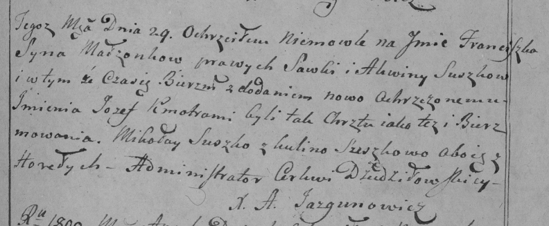

**Сушко Францишек Савов (Suszko Franciszek Jozef)**

29 марта 1800 г -- крещение (НИАБ 136-13-894, лист 41, №11/1800-р
(ориг), РГИА 823-2-18, лист 275, №11/1800-р (коп), НИАБ 136-13-949, лист
101об, №11/1800-р (коп)).

**НИАБ 136-13-894:** Лист 41. **Метрическая запись №11/1800-р (ориг).**

Дедиловичская Покровская церковь. 29 марта 1800 года. Метрическая запись
о крещении.

Suszkowa Franciszek Jozef -- сын родителей с деревни Разлитье.

Suszko Sawka -- отец.

Suszkowa Aksynja -- мать.

Suszko Mikołay -- кум, с деревни Горелое.

Suszkowa Kulina -- кума, с деревни Разлитье.

Jazgunowicz Antoni -- ксёндз.

**РГИА 823-2-18:** Лист 275. **Метрическая запись №11/1800-р (коп).**

Дедиловичская Покровская церковь. 29 марта 1800 года. Метрическая запись
о крещении.

Suszko Franciszek Jozef -- сын родителей с деревни \[Разлитье\].

Suszko Sawka -- отец.

Suszkowa Akwina -- мать.

Suszko Mikołay -- кум, с деревни Горелое.

Suszkowa Kulina -- кума, с деревни Горелое.

Jazgunowicz Antoni -- ксёндз.

**НИАБ 136-13-949:** Лист 101об. **Метрическая запись №11/1800-р
(коп).**

(См. тж.: РГИА 823-2-18, лист 275, №11/1800-р (коп), НИАБ 136-13-894,
лист 41, №11/1800-р (ориг))

Дедиловичская Покровская церковь. 29 марта 1800 года. Метрическая запись
о крещении.

Suszko Jozef Franciszak \[Franciszek Jozef\] -- сын родителей с деревня
Разлитье.

Suszko Sawa -- отец.

Suszkowa Akwiła \[Aksynja\] -- мать.

Suszko Mikołay -- кум, с деревни Горелое.

Suszkowa Kulina - кума, с деревни Горелое \[Разлитье\].

Jazgunowicz Antoni -- ксёндз.
