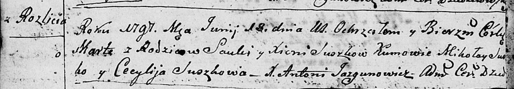

**Сушко Хведор Савов (Suszko Chwiedor)**

12 мая 1807 г -- крещение (НИАБ 136-13-894, лист 62об, №25/1807-р
(ориг)).

**НИАБ 136-13-894:** Лист 62об. **Метрическая запись №25/1807-р
(ориг).**

{width="6.496527777777778in"
height="0.9970417760279965in"}

Дедиловичская Покровская церковь. 12 мая 1807 года. Метрическая запись о
крещении.

Suszko Chwiedor -- сын родителей с деревни Разлитье.

Suszko Sauka -- отец.

Suszkowa Xienia -- мать.

Suszko Jakub -- кум, с деревни Горелое.

Suszkowa Cecylia -- кума, с деревни Горелое.

Jazgunowicz Antoni -- ксёндз.
