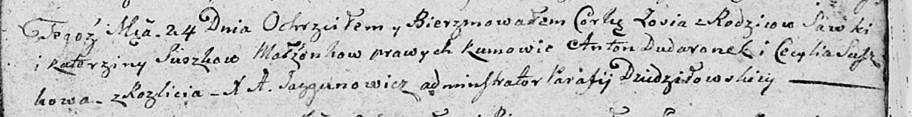

**Сушко Зося Савкова (Suszkowna Zosia)**

24 октября 1809 г -- крещение (НИАБ 136-13-894, лист 76, №57/1809-р
(ориг)).

**НИАБ 136-13-894:** Лист 76. **Метрическая запись №57/1809-р (ориг).**

Дедиловичская Покровская церковь. 24 октября 1809 года. Метрическая
запись о крещении.

Suszkowna Zosia -- дочь родителей из деревни Разлитье.

Suszko Sawka -- отец.

Suszkowa Katerzyna -- мать.

Dudaronek Anton -- кум.

Suszkowa Cecylia -- кума.

Jazgunowicz Antoni -- ксёндз.
