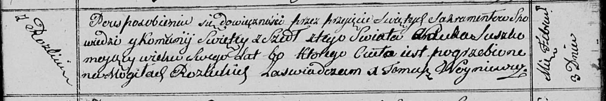

**Сушко Савка (Suszko Sawka)**

5 июля 1808 г -- венчание с вдовой Катериной Брытко с деревни Лустичи
(НИАБ 136-13-920, лист 13об, №3/1808-б (ориг)).

24 октября 1809 г -- крещение дочери Зоси (НИАБ 136-13-894, лист 76,
№57/1809-р (ориг)).

3 февраля 1813 г -- отпевание, умер в возрасте 60 лет (родился около
1753 г) (НИАБ 136-13-894, лист 76, №57/1809-р (ориг)).

**НИАБ 136-13-920:** Лист 13об. **Метрическая запись №3/1808-б (ориг).**

{width="6.496527777777778in"
height="1.338999343832021in"}

Дедиловичская Покровская церковь. 5 июля 1808 года. Метрическая запись о
венчании.

Suszko Sauka -- жених, вдовец, с деревни Разлитье.

Brytkowa Katerzyna -- невеста, вдова, с деревни Лустичи.

Suszko Kuzma -- свидетель.

Suszko Jan -- свидетель.

Jazgunowicz Antoni -- ксёндз.

**НИАБ 136-13-894:** Лист 76. **Метрическая запись №57/1809-р (ориг).**

{width="6.496527777777778in"
height="0.8441666666666666in"}

Дедиловичская Покровская церковь. 24 октября 1809 года. Метрическая
запись о крещении.

Suszkowna Zosia -- дочь родителей из деревни Разлитье.

Suszko Sawka -- отец.

Suszkowa Katerzyna -- мать.

Dudaronek Anton -- кум.

Suszkowa Cecylia -- кума.

Jazgunowicz Antoni -- ксёндз.

**НИАБ 136-13-919:** Лист 25. **Метрическая запись №4/1813-у (ориг).**

{width="6.496527777777778in"
height="1.0916666666666666in"}

Осовская униатская церковь. 3 февраля 1813 года. Метрическая запись об
отпевании.

Suszko Sauka -- умерший, 60 лет, с деревни Разлитье, похоронен на
кладбище деревни Разлитье.

Woyniewicz Tomasz -- ксёндз.
