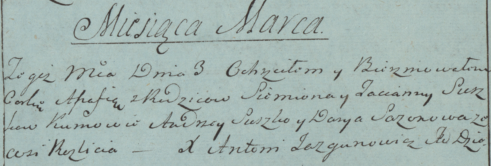

**Сушко Агафия Семёнова (Suszko Ahafija)**

3 марта 1784 г -- крещение (РГИА 823-2-18, лист 226, №7/1784-р (коп)).

**РГИА 823-2-18:** Лист 226. **Метрическая запись №7/1784-р (коп).**

Дедиловичская Покровская церковь. 3 марта 1784 года. Метрическая запись
о крещении.

Suszkowna Agafia -- дочь родителей с деревни Разлитье.

Suszko Siemion -- отец.

Suszkowa Tacianna -- мать.

Suszko Andrzey -- кум.

Sorokowa Darya - кума.

Jazgunowicz Antoni -- ксёндз.
