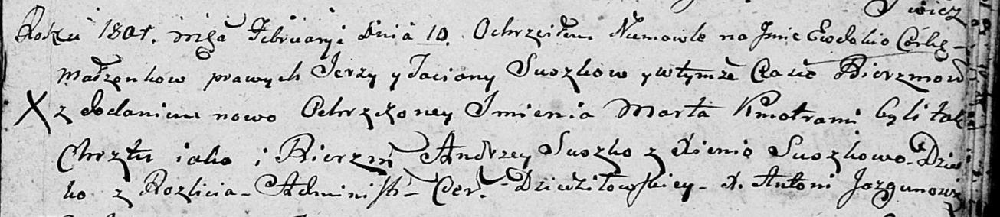

**Сушко Марьяна Сергеева (Suszkowna Marjana Justyna)**

9 июля 1803 г -- крещение (НИАБ 136-13-894, лист 51, №26/1803-р (ориг)).

**НИАБ 136-13-894:** Лист 43. **Метрическая запись №5/1801-р (ориг).**

{width="6.496527777777778in"
height="1.4140955818022747in"}

Дедиловичская Покровская церковь. 10 февраля 1801 года. Метрическая
запись о крещении.

Suszkowna Ewdokija Marta -- дочь родителей с деревни Разлитье.

Suszko Jerzy -- отец.

Suszkowa Taciana -- мать.

Suszko Andrzey -- кум.

Suszkowa Xienia -- кума.

Jazgunowicz Antoni -- ксёндз.
