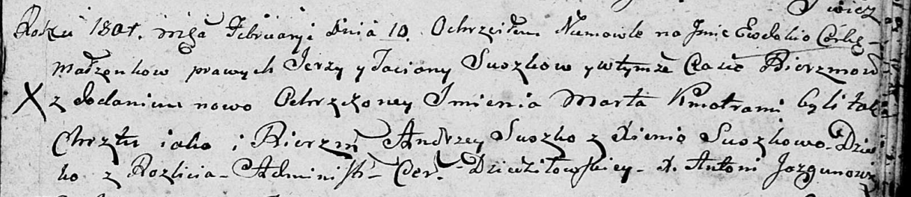
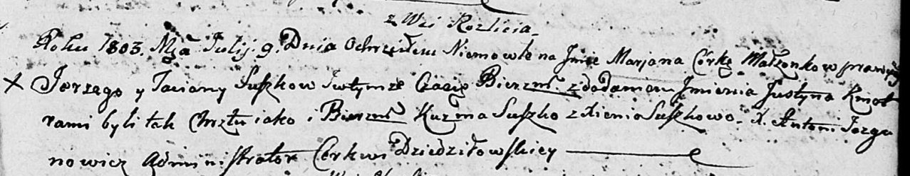

**Сушко Сергей (Suszko Jerzy)**

10 февраля 1801 г -- крещение дочери Евдокии Марты (НИАБ 136-13-894,
лист 43, №5/1801-р (ориг)).

9 июля 1803 г -- крещение дочери Марьяны Юстыны (НИАБ 136-13-894, лист
51, №26/1803-р (ориг)).

**НИАБ 136-13-894:** Лист 43. **Метрическая запись №5/1801-р (ориг).**

Дедиловичская Покровская церковь. 10 февраля 1801 года. Метрическая
запись о крещении.

Suszkowna Ewdokija Marta -- дочь родителей с деревни Разлитье.

Suszko Jerzy -- отец.

Suszkowa Taciana -- мать.

Suszko Andrzey -- кум.

Suszkowa Xienia -- кума.

Jazgunowicz Antoni -- ксёндз.

**НИАБ 136-13-894:** Лист 51. **Метрическая запись №26/1803-р (ориг).**

Дедиловичская Покровская церковь. 9 июля 1803 года. Метрическая запись о
крещении.

Suszkowna Marjana Justyna -- дочь родителей с деревни Разлитье.

Suszko Jerzy -- отец.

Suszkowa Taciana -- мать.

Suszko Kuźma -- кум.

Suszkowa Xienia -- кума.

Jazgunowicz Antoni -- ксёндз.
