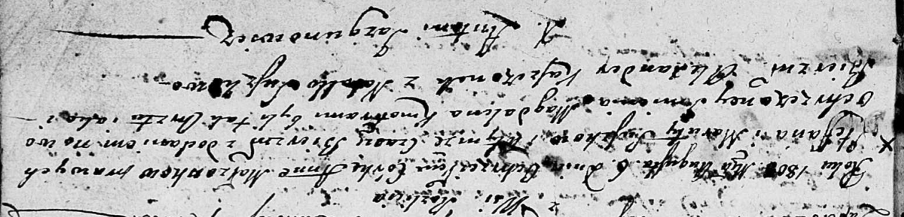

**Сушко Анна Степанова (Suszkowna Anna Magdalena)**

6 августа 1803 г -- крещение (НИАБ 136-13-894, лист 51, №31/1803-р
(ориг)).

**НИАБ 136-13-894:** Лист 51. **Метрическая запись №31/1803-р (ориг).**

{width="6.496527777777778in"
height="1.5689829396325459in"}

Дедиловичская Покровская церковь. 6 августа 1803 года. Метрическая
запись о крещении.

Suszkowna Anna Magdalena -- дочь родителей с деревни Разлитье.

Suszko Stefan -- отец.

Suszkowa Maruta -- мать.

Kaszczonek Alexander -- кум.

Suszkowa Natalla -- кума.

Jazgunowicz Antoni -- ксёндз.
