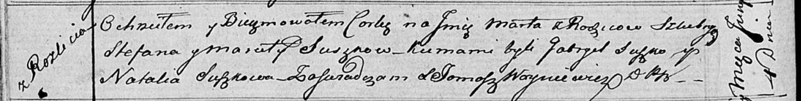

**Сушко Марта Степанова (Suszkowna Marta)**

4 июня 1816 г -- крещение (НИАБ 136-13-894, лист 93об, №16/1816-р
(ориг)).

**НИАБ 136-13-894:** Лист 93об. **Метрическая запись №16/1816-р
(ориг).**

Осовская Покровская церковь. 4 июня 1816 года. Метрическая запись о
крещении.

Suszkowna Marta -- дочь родителей с деревни Разлитье.

Suszko Stefan -- отец.

Suszkowa Maruta -- мать.

Suszko Gabryel -- кум.

Suszkowa Natalla -- кума.

Woyniewicz Tomasz -- ксёндз.
