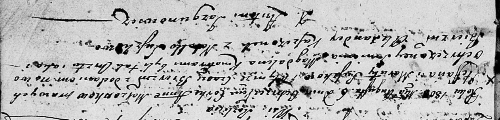
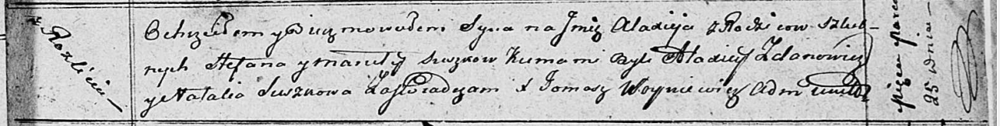
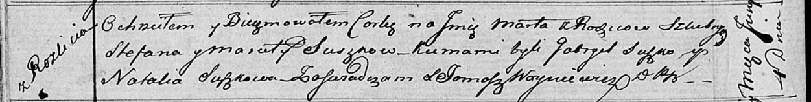

**Сушко Марута (Suszkowa Maruta, Marjana)**

6 августа 1803 г -- крещение дочери Анны Магдалены (НИАБ 136-13-894,
лист 51, №31/1803-р (ориг)).

23 января 1805 г -- крещение сына Петра Павла (НИАБ 136-13-894, лист
56об, №7/1805-р (ориг)).

2 мая 1807 г -- крещение сына Якуба Борыса (НИАБ 136-13-894, лист 62об,
№22/1807-р (ориг)).

22 августа 1809 г -- крещение сына Яна (НИАБ 136-13-894, лист 75об,
№43/1809-р (ориг)).

25 марта 1812 г -- крещение сына Аляксея (НИАБ 136-13-894, лист 84,
№21/1812-р (ориг)).

4 июня 1816 г -- крещение дочери Марты (НИАБ 136-13-894, лист 93об,
№16/1816-р (ориг)).

11 января 1819 г -- отпевание, умерла в возрасте 40 лет (родилась около
1779 г) (НИАБ 136-13-919, лист 32об, №1/1819-у (ориг)).

**НИАБ 136-13-894:** Лист 51. **Метрическая запись №31/1803-р (ориг).**

Дедиловичская Покровская церковь. 6 августа 1803 года. Метрическая
запись о крещении.

Suszkowna Anna Magdalena -- дочь родителей с деревни Разлитье.

Suszko Stefan -- отец.

Suszkowa Maruta -- мать.

Kaszczonek Alexander -- кум.

Suszkowa Natalla -- кума.

Jazgunowicz Antoni -- ксёндз.

**НИАБ 136-13-894:** Лист 56об. **Метрическая запись №7/1805-р (ориг)**

Дедиловичская Покровская церковь. 23 января 1805 года. Метрическая
запись о крещении.

Suszko Piotr Paweł -- сын родителей с деревни Разлитье.

Suszko Stefan -- отец.

Suszkowa Maruta -- мать.

Kosztonek Alexander -- кум, с деревни Разлитье.

Suszkowa Zynowia -- кума, с деревни Разлитье.

Jazgunowicz Antoni -- ксёндз.

**НИАБ 136-13-894:** Лист 62об. **Метрическая запись №22/1807-р
(ориг).**

Дедиловичская Покровская церковь. 2 мая 1807 года. Метрическая запись о
крещении.

Suszko Jakub Barys -- сын родителей с деревни Разлитье.

Suszko Stefan -- отец.

Suszkowa Maruta -- мать.

Koszczyc Alexander -- кум, с деревни Недаль.

Suszkowa Natalla -- кума, с деревни Недаль.

Jazgunowicz Antoni -- ксёндз.

**НИАБ 136-13-894:** Лист 75об. **Метрическая запись №43/1809-р
(ориг).**

Дедиловичская Покровская церковь. 22 августа 1809 года. Метрическая
запись о крещении.

Suszko Jan -- сын родителей с деревни Разлитье.

Suszko Stefan -- отец.

Suszkowa Marjana -- мать.

Żdanowicz Alexander -- кум.

Suszkowa Natalla -- кума.

Miszkun Marek -- ксёндз.

**НИАБ 136-13-894:** Лист 84. **Метрическая запись №21/1812-р (ориг).**

Осовская Покровская церковь. 25 марта 1812 года. Метрическая запись о
крещении.

Suszko Alaxiej -- сын родителей с деревни Разлитье.

Suszko Stefan -- отец.

Suszkowa Maruta -- мать.

Żdanowicz Alaxiej -- кум.

Suszkowa Natalia -- кума.

Woyniewicz Tomasz -- ксёндз.

**НИАБ 136-13-894:** Лист 93об. **Метрическая запись №16/1816-р
(ориг).**

Осовская Покровская церковь. 4 июня 1816 года. Метрическая запись о
крещении.

Suszkowna Marta -- дочь родителей с деревни Разлитье.

Suszko Stefan -- отец.

Suszkowa Maruta -- мать.

Suszko Gabryel -- кум.

Suszkowa Natalla -- кума.

Woyniewicz Tomasz -- ксёндз.

**НИАБ 136-13-919:** Лист 32об. **Метрическая запись №1/1819-у (ориг).**

Осовская униатская церковь. 11 января 1819 года. Метрическая запись об
отпевании.

Suszkowa Maruta -- умершая, 40 лет, с деревни Разлитье, похоронена на
кладбище деревни Разлитье.

Woyniewicz Tomasz -- ксёндз.
