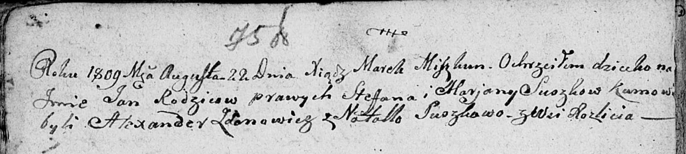

**Сушко Ян Степанов (Suszko Jan)**

22 августа 1809 г -- крещение (НИАБ 136-13-894, лист 75об, №43/1809-р
(ориг)).

**НИАБ 136-13-894:** Лист 75об. **Метрическая запись №43/1809-р
(ориг).**

Дедиловичская Покровская церковь. 22 августа 1809 года. Метрическая
запись о крещении.

Suszko Jan -- сын родителей с деревни Разлитье.

Suszko Stefan -- отец.

Suszkowa Marjana -- мать.

Żdanowicz Alexander -- кум.

Suszkowa Natalla -- кума.

Miszkun Marek -- ксёндз.
