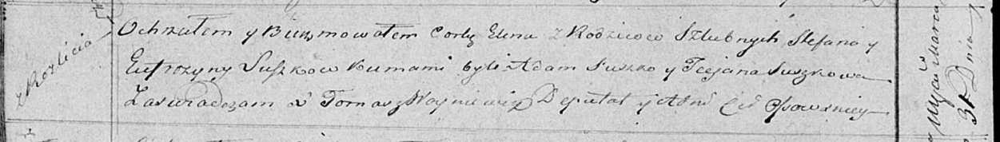

**Сушко Елена Стефанова (Suszkowna Elena)**

31 марта 1819 г -- крещение (НИАБ 136-13-894, лист 100об, №16/1819-р
(ориг)).

**НИАБ 136-13-894:** Лист 100об. **Метрическая запись №16/1819-р
(ориг).**

Осовская Покровская церковь. 31 марта 1819 года. Метрическая запись о
крещении.

Suszkowna Elena -- дочь родителей с деревни Разлитье.

Suszko Stefan -- отец.

Suszkowa Eufrozyna -- мать.

Suszko Adam -- кум.

Suszkowa Taciana -- кума.

Woyniewicz Tomasz -- ксёндз.
