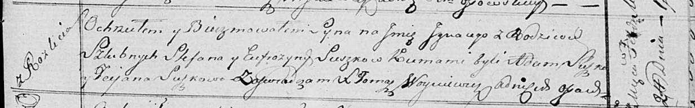

**Сушко Игнацы Стефанов (Suszko Jgnacy)**

24 февраля 1818 г -- крещение (НИАБ 136-13-894, лист 98, №7/1818-р
(ориг)).

**НИАБ 136-13-894:** Лист 98. **Метрическая запись №7/1818-р (ориг).**

{width="6.496527777777778in"
height="1.017156605424322in"}

Осовская Покровская церковь. 24 февраля 1818 года. Метрическая запись о
крещении.

Suszko Jgnacy -- сын родителей с деревни Разлитье.

Suszko Stefan -- отец.

Suszkowa Eufrozyna -- мать.

Suszko Adam -- кум.

Suszkowa Taciana -- кума.

Woyniewicz Tomasz -- ксёндз.
