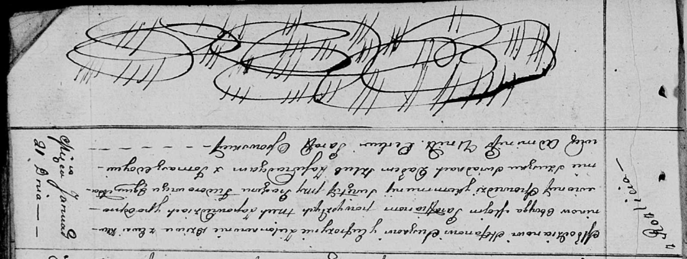
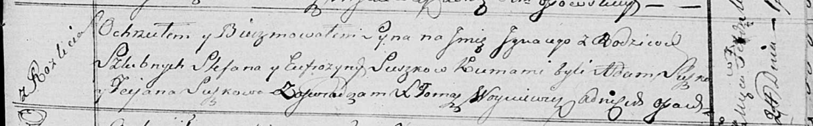
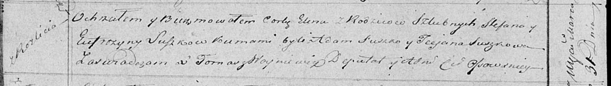

**Сушко Стефан (Suszko Stefan)**

21 января 1812 г -- венчание с девкой Евфрозыной Зелёнко с деревни
Клинники (НИАБ 136-13-920, лист 18, №2/1812-б (ориг)).

24 февраля 1818 г -- крещение сына Игнацыя (НИАБ 136-13-894, лист 98,
№7/1818-р (ориг)).

31 марта 1819 г -- крещение дочери Елены (НИАБ 136-13-894, лист 100об,
№16/1819-р (ориг)).

**НИАБ 136-13-920:** Лист 18. **Метрическая запись №2/1812-б (ориг).**

Осовская Покровская церковь. 21 января 1812 года. Метрическая запись о
венчании.

Suszko Stefan -- жених, молодой, парафии Осовской, с деревни Разлитье.

Zielonkowna Eufrozynia -- невеста, девка, парафии Осовской, с деревни
Клинники.

Fiedorowicz Prochor -- свидетель.

Szuszko Adam -- свидетель.

Woyniewicz Tomasz -- ксёндз.

**НИАБ 136-13-894:** Лист 98. **Метрическая запись №7/1818-р (ориг).**

Осовская Покровская церковь. 24 февраля 1818 года. Метрическая запись о
крещении.

Suszko Jgnacy -- сын родителей с деревни Разлитье.

Suszko Stefan -- отец.

Suszkowa Eufrozyna -- мать.

Suszko Adam -- кум.

Suszkowa Taciana -- кума.

Woyniewicz Tomasz -- ксёндз.

**НИАБ 136-13-894:** Лист 100об. **Метрическая запись №16/1819-р
(ориг).**

Осовская Покровская церковь. 31 марта 1819 года. Метрическая запись о
крещении.

Suszkowna Elena -- дочь родителей с деревни Разлитье.

Suszko Stefan -- отец.

Suszkowa Eufrozyna -- мать.

Suszko Adam -- кум.

Suszkowa Taciana -- кума.

Woyniewicz Tomasz -- ксёндз.
