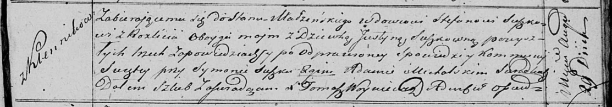

**Сушко Стефан (Suszko Stefan)**

29 августа 1820 г -- венчание с девкой Юстыной Сушко с деревни Клинники
(НИАБ 136-13-920, лист 27, №4/1820-б (ориг)).

**НИАБ 136-13-920:** Лист 27. **Метрическая запись №4/1820-б (ориг).**

Осовская Покровская церковь. 29 августа 1820 года. Запись о венчании.

Suszko Stefan -- жених, вдовец, парафии Осовской, с деревни Разлитье.

Suszkowna Justyna -- невеста, девка, парафии Осовской, с деревни
Клинники.

Suszko Symon -- свидетель.

Michalski Adam -- свидетель.

Woyniewicz Tomasz -- ксёндз.
