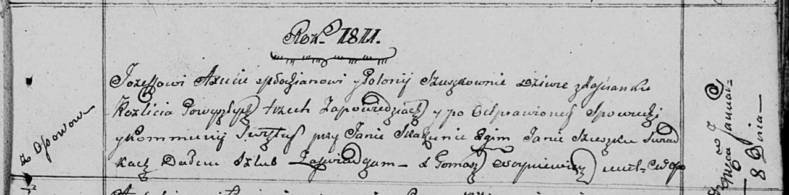

**Аксюта (в девичестве Сушко) Полония (Axiutowa Połonija z Suszkow)**

8 января 1811 г -- венчание с молодым Иосифом Аксютой с деревни Осово
(НИАБ 136-13-920, лист 17, №1/1811-б (ориг)).

**НИАБ 136-13-920:** Лист 17. **Метрическая запись №1/1811-б (ориг).**

Осовская Покровская церковь. 8 января 1811 года. Метрическая запись о
венчании.

Axiuta Jozef -- жених, молодой, с деревни Осовo.

Szuszkowna Połonija -- невеста, девка, застенок Разлитье.

Skakun Jan -- свидетель.

Szuszko Jan -- свидетель.

Woyniewicz Tomasz -- ксёндз.
