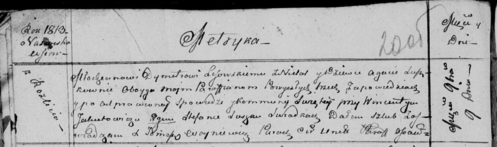

**Лисовская (в девичестве Сушко) Агата (Lisowska Agata z Suszkow)**

9 ноября 1813 г -- венчание с молодым Дмитрием Лисичёнком с деревни
Недаль (НИАБ 136-13-920, лист 20об, №23/1813-б (ориг)).

**НИАБ 136-13-894:** Лист 20об. **Метрическая запись №23/1813-б
(ориг).**

Осовская Покровская церковь. 9 ноября 1813 года. Запись о венчании.

Lisowski Dymitr -- жених, молодой, парафии Осовской, с деревни Недаль.

Suszkowna Agata -- невеста, девка, парафии Осовской, с деревни Разлитье.

Jakubowicz Wincenty -- свидетель.

Suszko Stefan -- свидетель.

Woyniewicz Tomasz -- ксёндз.
