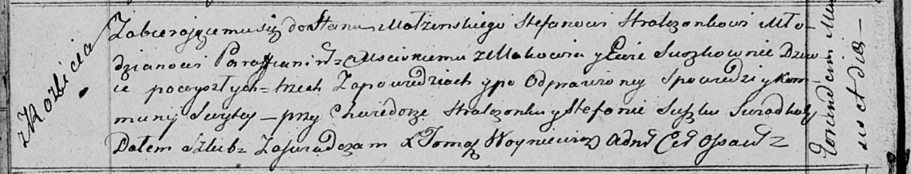

**Стрельчёнок (в девичестве Сушко) Ева (Stralczonkowa Ewa z Suszkow)**

10 ноября 1818 г -- венчание с молодым Стефаном Стрельчёнком с деревни
Маковье (НИАБ 136-13-920, лист 25об, №10/1818-б (ориг)).

**НИАБ 136-13-894:** Лист 25об. **Метрическая запись №10/1818-б
(ориг).**

Осовская Покровская церковь. 10 ноября 1818 года. Запись о венчании.

Stralczonek Stefan -- жених, молодой, парафии Мстижской, с деревни
Маковье.

Suszkowna Ewa -- невеста, девка, с деревни Разлитье.

Stralczonek Chwiedor -- свидетель.

Suszko Stefan -- свидетель.

Woyniewicz Tomasz -- ксёндз.
