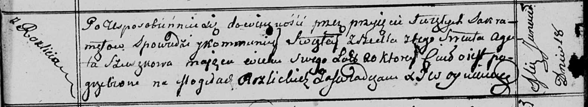

**Сушко Агата (Szuszkowa Agata)**

18 января 1813г -- отпевание, умерла в возрасте 20 лет (родилась около
1793 г) (НИАБ 136-13-919, лист 25, №2/1813-у (ориг)).

**НИАБ 136-13-919:** Лист 25. **Метрическая запись №2/1813-у (ориг).**

Осовская униатская церковь. 18 января 1813 года. Метрическая запись об
отпевании.

Szuszkowa Agata -- умершая, 20 лет, с деревни Разлитье, похоронена на
кладбище деревни Разлитье.

Woyniewicz Tomasz -- ксёндз.
