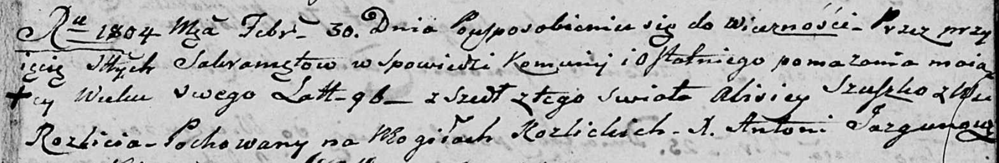

**Сушко Алисей (Suszko Alisiey)**

30 февраля 1804 г -- отпевание, умер в возрасте 96 лет (родился около
1708 г) (НИАБ 136-13-919, лист 15, №3/1804-у (ориг)).

**НИАБ 136-13-919:** Лист 15. **Метрическая запись №3/1804-у (ориг).**

Дедиловичская Покровская церковь. 30 февраля 1804 года. Метрическая
запись об отпевании.

Szuszko Alisiey -- умерший, 96 лет, с деревни Разлитье, похоронен на
кладбище деревни Разлитье.

Jazgunowicz Antoni -- ксёндз.
