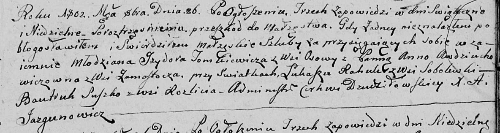

**Сушко Бавтрук (Suszko Bautruk)**

26 октября 1802 г -- свидетель венчания молодого Изыдора Томковича с
деревни Осово с Анной Авдюхович с деревни Замосточье (НИАБ 136-13-894,
лист 8, №3/1802-б (ориг)).

**НИАБ 136-13-920:** Лист 8. **Метрическая запись №3/1802-б (ориг).**

Дедиловичская Покровская церковь. 26 октября 1802 года. Метрическая
запись о венчании.

Tomkiewicz Jzydor -- жених, молодой, с деревни Осовo.

Awdziuchowichowna Anna -- невеста, с деревни Замосточье.

Rоhula Łukasz -- свидетель, с деревни Соболевка.

Suszko Bautruk -- свидетель, с деревни Разлитье.

Jazgunowicz Antoni -- ксёндз.
