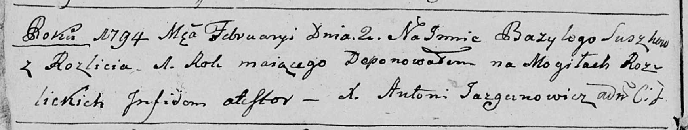

**Сушко Базыль (Suszko Bazyl)**

2 февраля 1794 г -- отпевание, с деревни Разлитье, родился 1793 - январь
1794 г (возраст 1 год) (НИАБ 136-13-919, лист 1об, №5/1794-у (ориг)).

**НИАБ 136-13-919:** Лист 1об. **Метрическая запись №5/1794-у (ориг).**

Дедиловичская Покровская церковь. 2 февраля 1794 года. Метрическая
запись об отпевании.

Suszko Bazyli -- умерший, 1 год, с Разлитья, похоронен на кладбище
деревни Разлитье.

Jazgunowicz Antoni -- ксёндз.
