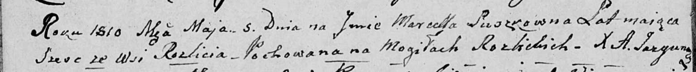

**Кучка (Сушко) Евдокия (Kuczkowa Ewdokia z Suszkow)**

14 января 1795 г -- венчание с Сушко Евдокией с деревни Разлитье (НИАБ
136-13-920, лист 1об, №1/1795-б (ориг)).

**НИАБ 136-13-920:** Лист 1об. **Метрическая запись №1/1795-б (ориг).**

{width="6.496527777777778in"
height="1.7245406824146983in"}

Дедиловичская Покровская церковь. 14 января 1795 года. Метрическая
запись о венчании.

Kuczka Jwan -- жених, деревня Разлитье.

Suszkowna Ewdokia -- невеста, девка, деревня Разлитье.

Suszko Leon -- свидетель, деревня Разлитье.

Suszko Nuprey -- свидетель.

Jazgunowicz Antoni -- ксёндз.
