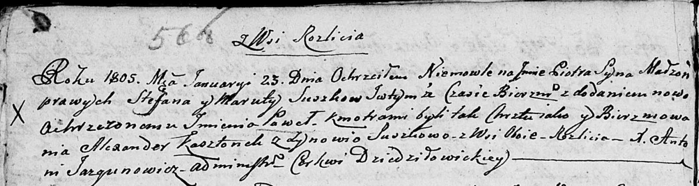

**Сушко Зыновия (Suszkowa Zynowia)**

23 января 1805 г -- крестная мать у Петра Павла, сына Сушков Степана
Маруты с деревни Разлитье (НИАБ 136-13-894, лист 56об, №7/1805-р (коп)).

**НИАБ 136-13-894:** Лист 56об. **Метрическая запись №7/1805-р (ориг)**

Дедиловичская Покровская церковь. 23 января 1805 года. Метрическая
запись о крещении.

Suszko Piotr Paweł -- сын родителей с деревни Разлитье.

Suszko Stefan -- отец.

Suszkowa Maruta -- мать.

Kosztonek Alexander -- кум, с деревни Разлитье.

Suszkowa Zynowia -- кума, с деревни Разлитье.

Jazgunowicz Antoni -- ксёндз.
