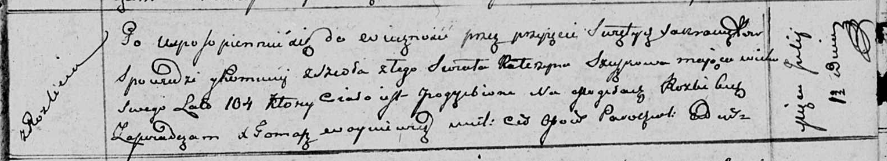

**Сушко Катерына (Szuszkowa Katerzyna)**

11 июля 1811 г -- отпевание, умерла в возрасте 104 года (родилась около
1707 г) (НИАБ 136-13-919, лист 23, №15/1811-у (ориг)).

**НИАБ 136-13-919:** Лист 23. **Метрическая запись №15/1811-у (ориг).**

Осовская униатская церковь. 11 июля 1811 года. Метрическая запись об
отпевании.

Szuszkowa Katerzyna -- умершая, 104 года, с деревни Разлитье, похоронена
на кладбище деревни Разлитье.

Woyniewicz Tomasz -- ксёндз.
