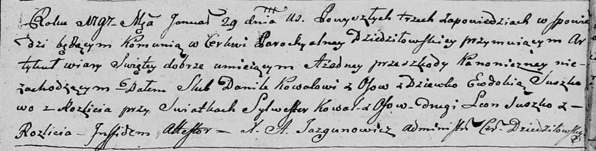

**Сушко Леон (Suszko Leon)**

29 января 1797 г -- свидетель венчания Данилы Коваля с деревни Осово с
девкой Евдокией Сушко с деревни Разлитье (НИАБ 136-13-920, лист 4,
№3/1797-б (ориг)).

**НИАБ 136-13-920:** Лист 4. **Метрическая запись №3/1797-б (ориг).**

Дедиловичская Покровская церковь. 29 января 1797 года. Метрическая
запись о венчании.

Kowal Daniła -- жених, с деревни Осовo.

Suszkowa Ewdokija -- невеста, девка с деревни Разлитье.

Kowal Sylwester -- свидетель, с деревни Осовo.

Suszko Leon -- свидетель, с деревни Разлитье.

Jazgunowicz Antoni -- ксёндз.
