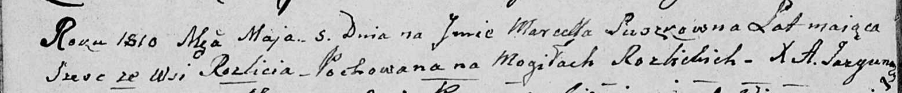

**Савицкая (Сушко) Марта (Sawicka (Suszko) Marta)**

7 ноября 1797 г -- венчание с Демьяном Савицким с деревни Дедиловичи
(НИАБ 136-13-920, лист 4об, №8/1797-б (коп)).

**НИАБ 136-13-920:** Лист 4об. **Метрическая запись №8/1797-б (ориг).**

{width="6.496527777777778in"
height="1.572334864391951in"}

Дедиловичская Покровская церковь. 7 ноября 1797 года. Метрическая запись
о венчании.

Sawicki Dziemjan -- жених, с деревни Дедиловичи.

Suszkowna Marta -- невеста, с деревни Разлитье.

Karżewicz Leon -- свидетель.

Suszko Janka -- свидетель, с деревни Дедиловичи.

Jazgunowicz Antoni -- ксёндз.
