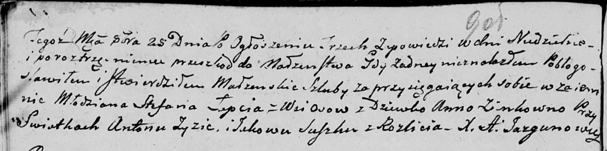

**Сушко Марцела (Suszkowna Marcella)**

5 мая 1810 г -- отпевание, умерла в возрасте 6 лет (родилась около 1804
г) (НИАБ 136-13-919, лист 21об, №4/1810-у (коп)).

**НИАБ 136-13-919:** Лист 21об. **Метрическая запись №4/1810-у (ориг).**

{width="6.496527777777778in"
height="0.6784722222222223in"}

Дедиловичская Покровская церковь. 5 мая 1810 года. Метрическая запись об
отпевании.

Suszkowna Marcella -- умершая, 6 лет, с деревни Разлитье, похоронена на
кладбище деревни Разлитье.

Jazgunowicz Antoni -- ксёндз.
