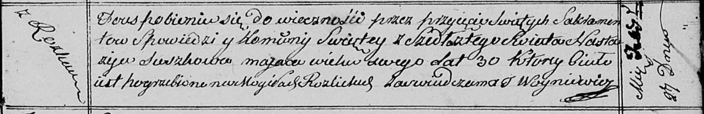

**Сушко Марьяна (Suszkowa Marjana)**

4 сентября 1820 г -- отпевание, умерла в возрасте 60 лет (НИАБ
136-13-919, лист 34, №18/1820-у (ориг)).

**НИАБ 136-13-919:** Лист 34. **Метрическая запись №18/1820-у (ориг).**

{width="6.496527777777778in"
height="1.0222222222222221in"}

Осовская униатская церковь. 4 сентября 1820 года. Метрическая запись об
отпевании.

Suszkowa Marjana -- умершая, 60 лет, с деревни Разлитье, похоронена на
кладбище деревни Разлитье.

Woyniewicz Tomasz -- ксёндз.
