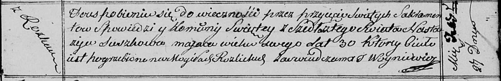

**Сушко Настасья (Suszkowa Nastazija)**

27 февраля 1813 г -- отпевание, умерла в возрасте 30 лет (родилась около
1783 г) (НИАБ 136-13-919, лист 25, №6/1813-у (ориг)).

**НИАБ 136-13-919:** Лист 25. **Метрическая запись №6/1813-у (ориг).**

Осовская униатская церковь. 27 февраля 1813 года. Метрическая запись об
отпевании.

Suszkowa Nastazija -- умершая, 30 лет, с деревни Разлитье, похоронена на
кладбище деревни Разлитье.

Woyniewicz Tomasz -- ксёндз.
