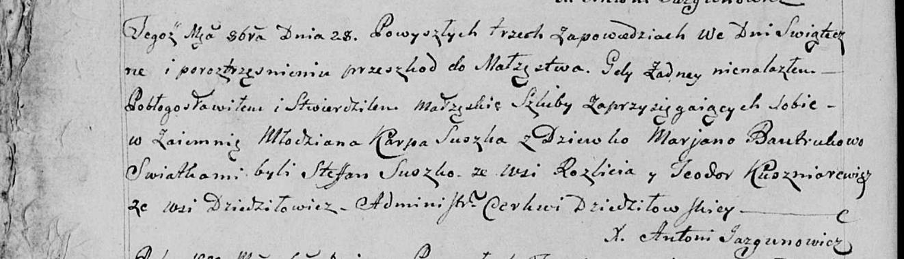

**Сушко Стефан (Suszko Stefan)**

28 октября 1800 г -- свидетель венчания молодого Карпа Сушко с деревни
Разлитье с девкой Марьяной Бавтрук (НИАБ 136-13-949, лист 107об,
№5/1800-б (коп)).

**НИАБ 136-13-949:** Лист 107об. **Метрическая запись №5/1800-б (коп).**

(См. тж.: НИАБ 136-13-920, лист 7, №5/1800-б (ориг))

Дедиловичская Покровская церковь. 28 октября 1800 года. Метрическая
запись о венчании.

Suszko Karp -- жених, молодой, с деревни \[Разлитье\].

Bautrukowa Marjana -- невеста, девка.

Suszko Stefan -- свидетель, с деревни Разлитье.

Kuszniarewicz Teodor -- свидетель, с деревни Дедиловичи.

Jazgunowicz Antoni -- ксёндз.
