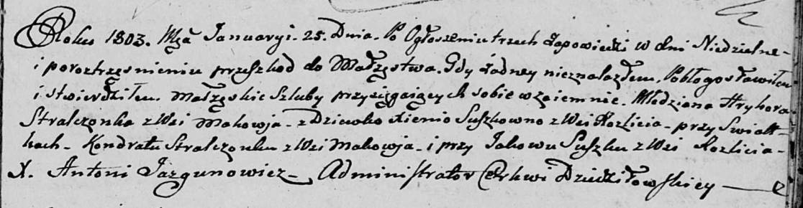
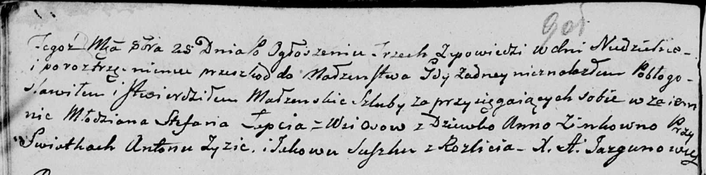

**Сушко Яков (Suszko Jakow)**

25 января 1803 г -- свидетель венчания молодого Грыгора Стрельчёнка с
деревни Маковье с девкой Ксеней Сушко с деревни Разлитье (НИАБ
136-13-920, лист 9, №1/1803-р (ориг)).

25 октября 1803 г -- свидетель венчания молодого Стефана Лапеца с
деревни Осово с девкой Анной Зинк (НИАБ 136-13-920, лист 9об, №6/1803-б
(ориг)).

**НИАБ 136-13-920:** Лист 9. **Метрическая запись №1/1803-б (ориг).**

Дедиловичская Покровская церковь. 25 января 1803 года. Метрическая
запись о венчании.

Stralczonek Hryhor -- жених, молодой, с деревни Маковье.

Suszkowna Xienia -- невеста, девка, с деревни Разлитье.

Stralczonek Kondrat -- свидетель, с деревни Маковье.

Suszko Jakow -- свидетель, с деревни Разлитье.

Jazgunowicz Antoni -- ксёндз.

**НИАБ 136-13-920:** Лист 9об. **Метрическая запись №6/1803-б (ориг).**

Дедиловичская Покровская церковь. 25 октября 1803 года. Метрическая
запись о венчании.

Łapac Stefan -- жених, молодой, с деревни Осовo.

Zinkowna Anna -- невеста, девка.

Zyz Anton -- свидетель.

Suszko Jakow -- свидетель, с деревни Разлитье.

Jazgunowicz Antoni -- ксёндз.
