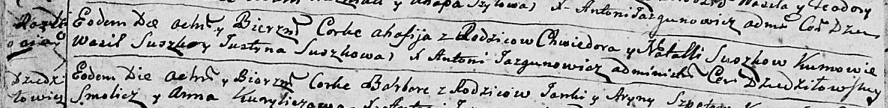

**Сушко Агафия Хведорова (Suszkowna Ahafija)**

22 августа 1792 г -- крещение (НИАБ 136-13-894, лист 16об, №49/1792-р
(ориг)).

**НИАБ 136-13-894:** Лист 16об. **Метрическая запись №49/1792-р
(ориг).**

{width="6.496527777777778in"
height="0.7965605861767279in"}

Дедиловичская Покровская церковь. 22 августа 1792 года. Метрическая
запись о крещении.

Suszkowna Ahafija -- дочь родителей с деревни Разлитье.

Suszko Chwiedor -- отец.

Suszkowa Natalla -- мать.

Suszko Wasil - кум.

Suszkowa Justyna - кума.

Jazgunowicz Antoni -- ксёндз.
