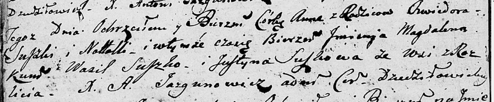

**Сушко Анна Хведорова (Suszkowna Anna Magdalena)**

5 июня 1804 г -- крещение (НИАБ 136-13-894, лист 53об, №15/1804-р
(ориг)).

**НИАБ 136-13-894:** Лист 53об. **Метрическая запись №15/1804-р
(ориг).**

Дедиловичская Покровская церковь. 5 июня 1804 года. Метрическая запись о
крещении.

Suszkowna Anna Magdalena -- дочь родителей с деревни Разлитье.

Suszko Chwiedor -- отец.

Suszkowa Natalla -- мать.

Suszko Wasil -- кум, с деревни Разлитье.

Suszkowa Justyna -- кума, с деревни Разлитье.

Jazgunowicz Antoni -- ксёндз.
