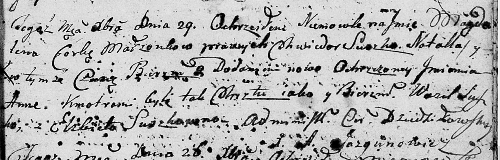

**Сушко Магдалена Хведорова (Suszkowna Magdalena Anna)**

29 декабря 1801 г -- крещение (НИАБ 136-13-894, лист 45, №34/1801-р
(ориг)).

**НИАБ 136-13-894:** Лист 45. **Метрическая запись №34/1801-р (ориг).**

{width="6.496527777777778in"
height="2.0832600612423446in"}

Дедиловичская Покровская церковь. 29 декабря 1801 года. Метрическая
запись о крещении.

Suszkowna Magdalena Anna -- дочь родителей \[с деревни Разлитье\].

Suszko Chwiedor -- отец.

Suszkowa Natalla -- мать.

Suszko Wasil -- кум.

Suszkowna Elżbieta -- кума.

Jazgunowicz Antoni -- ксёндз.
