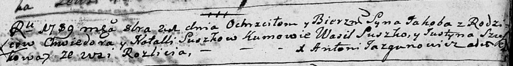
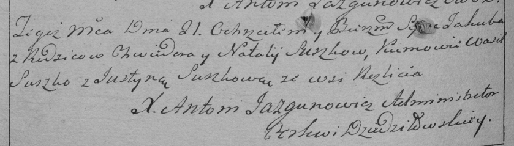
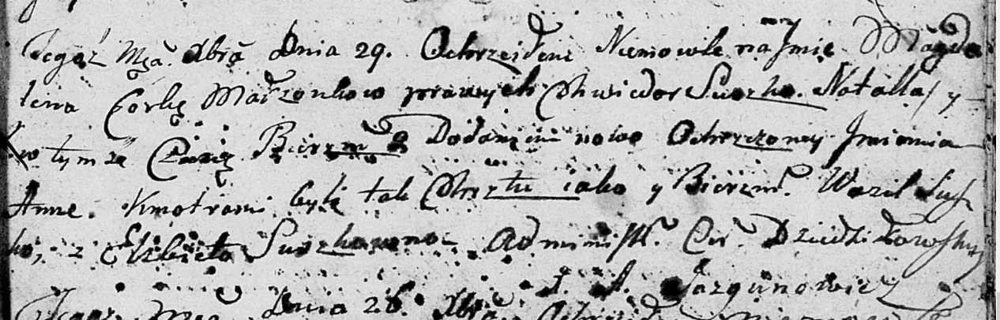
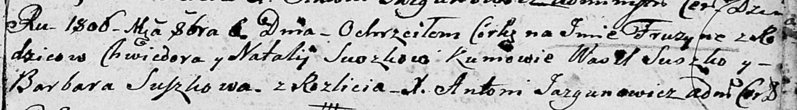

**Сушко Наталья (Suszkowa Natalla)**

21 октября 1789 г -- крещение сына Якоба (НИАБ 136-13-894, лист 8,
№55/1789-р (ориг)), (РГИА 823-2-18, лист 238об, №26/1789-р (коп)).

22 августа 1792 г -- крещение дочери Агафии (НИАБ 136-13-894, лист 16об,
№49/1792-р (ориг)).

10 июня 1795 г -- крещение сына Балтромея (НИАБ 136-13-894, лист 24об,
№16/1795-р (ориг)), (РГИА 823-2-18, лист 252об, №13/1795-р (коп)).

6 июля 1796 г -- крещение дочери Петрунели (НИАБ 136-13-894, лист 29об,
№65/1796-р (ориг)), (РГИА 823-2-18, лист 256об, №36/1796-р (коп)).

29 декабря 1801 г -- крещение дочери Магдалены Анны (НИАБ 136-13-894,
лист 45, №34/1801-р (ориг)).

5 июня 1804 г -- крещение дочери Анны Магдалены (НИАБ 136-13-894, лист
53об, №15/1804-р (ориг)).

6 октября 1806 г -- крещение дочери Фрузыны (НИАБ 136-13-894, лист 61,
№44/1806-р (ориг)).

**НИАБ 136-13-894:** Лист 8. **Метрическая запись №55/1789-р (ориг).**

Дедиловичская Покровская церковь. 21 октября 1789 года. Метрическая
запись о крещении.

Suszko Jakob -- сын родителей с деревни Разлитье.

Suszko Chwiedor -- отец.

Suszkowa Natalla -- мать.

Suszko Wasil - кум.

Szuszkowa Justyna - кума.

Jazgunowicz Antoni -- ксёндз.

**РГИА 823-2-18:** Лист 238об. **Метрическая запись №26/1789-р (коп).**

Дедиловичская Покровская церковь. 21 октября 1789 года. Метрическая
запись о крещении.

Suszko Jakub -- сын родителей с деревни Разлитье.

Suszko Chwiedor -- отец.

Suszko Natalja -- мать.

Suszko Wasil -- кум.

Suszkowa Justyna - кума.

Jazgunowicz Antoni -- ксёндз.

**НИАБ 136-13-894:** Лист 16об. **Метрическая запись №49/1792-р
(ориг).**

Дедиловичская Покровская церковь. 22 августа 1792 года. Метрическая
запись о крещении.

Suszkowna Ahafija -- дочь родителей с деревни Разлитье.

Suszko Chwiedor -- отец.

Suszkowa Natalla -- мать.

Suszko Wasil - кум.

Suszkowa Justyna - кума.

Jazgunowicz Antoni -- ксёндз.

**НИАБ 136-13-894:** Лист 24-об. **Метрическая запись №16/1795-р
(ориг).**

Дедиловичская Покровская церковь. 10 июня 1795 года. Метрическая запись
о крещении.

Suszko Bałtromey -- сын родителей с деревни Разлитье.

Suszko Chwiedor -- отец.

Suszkowa Natalla -- мать.

Suszko Andrzey - кум.

Suszkowa Justyna - кума.

Jazgunowicz Antoni -- ксёндз.

**РГИА 823-2-18:** Лист 252об. **Метрическая запись №13/1795-р (коп).**

Дедиловичская Покровская церковь. 10 июня 1795 года. Метрическая запись
о крещении.

Suszko Bałtromiey -- сын родителей с деревни Разлитье.

Suszko Chwiedor -- отец.

Suszkowa Natalla -- мать.

Suszko Andrzey -- кум.

Suszkowa Justyna -- кума.

Jazgunowicz Antoni -- ксёндз.

**НИАБ 136-13-894:** Лист 30. **Метрическая запись №65/1796-р (ориг).**

Дедиловичская Покровская церковь. 6 июля 1796 года. Метрическая запись о
крещении.

Suszkowna Petrunela -- дочь родителей с деревни Разлитье.

Suszko Chwiedor -- отец.

Suszkowa Natalla -- мать.

Suszko Wasil - кум.

Suszkowa Justyna - кума.

Jazgunowicz Antoni -- ксёндз.

**РГИА 823-2-18:** Лист 256об. **Метрическая запись №36/1796-р (коп).**

Дедиловичская Покровская церковь. 6 июля 1796 года. Метрическая запись о
крещении.

Suszkowna Petrunella -- дочь родителей с деревни Разлитье.

Suszko Chwiedor -- отец.

Suszkowa Natalla -- мать.

Suszko Wasil -- кум.

Suszkowa Justyna -- кума.

Jazgunowicz Antoni -- ксёндз.

**НИАБ 136-13-894:** Лист 45. **Метрическая запись №34/1801-р (ориг).**

Дедиловичская Покровская церковь. 29 декабря 1801 года. Метрическая
запись о крещении.

Suszkowna Magdalena Anna -- дочь родителей \[с деревни Разлитье\].

Suszko Chwiedor -- отец.

Suszkowa Natalla -- мать.

Suszko Wasil -- кум.

Suszkowna Elżbieta -- кума.

Jazgunowicz Antoni -- ксёндз.

**НИАБ 136-13-894:** Лист 53об. **Метрическая запись №15/1804-р
(ориг).**

Дедиловичская Покровская церковь. 5 июня 1804 года. Метрическая запись о
крещении.

Suszkowna Anna Magdalena -- дочь родителей с деревни Разлитье.

Suszko Chwiedor -- отец.

Suszkowa Natalla -- мать.

Suszko Wasil -- кум, с деревни Разлитье.

Suszkowa Justyna -- кума, с деревни Разлитье.

Jazgunowicz Antoni -- ксёндз.

**НИАБ 136-13-894:** Лист 61. **Метрическая запись №44/1806-р (ориг).**

Дедиловичская Покровская церковь. 6 октября 1806 года. Метрическая
запись о крещении.

Suszkowna Fruzyna -- дочь родителей с деревни Разлитье.

Suszko Chwiedor -- отец.

Suszkowa Natalija -- мать.

Suszko Wasil -- кум.

Suszkowa Barbara -- кума.

Jazgunowicz Antoni -- ксёндз.
