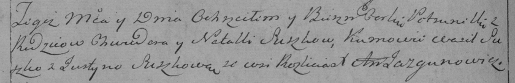

**Сушко Петрунеля Хведорова (Suszkowna Petrunela)**

6 июля 1796 г -- крещение (НИАБ 136-13-894, лист 29об, №65/1796-р
(ориг)), (РГИА 823-2-18, лист 256об, №36/1796-р (коп)).

**НИАБ 136-13-894:** Лист 30. **Метрическая запись №65/1796-р (ориг).**

{width="6.496527777777778in"
height="0.7643766404199475in"}

Дедиловичская Покровская церковь. 6 июля 1796 года. Метрическая запись о
крещении.

Suszkowna Petrunela -- дочь родителей с деревни Разлитье.

Suszko Chwiedor -- отец.

Suszkowa Natalla -- мать.

Suszko Wasil - кум.

Suszkowa Justyna - кума.

Jazgunowicz Antoni -- ксёндз.

**РГИА 823-2-18:** Лист 256об. **Метрическая запись №36/1796-р (коп).**

{width="6.496527777777778in"
height="1.0520833333333333in"}

Дедиловичская Покровская церковь. 6 июля 1796 года. Метрическая запись о
крещении.

Suszkowna Petrunella -- дочь родителей с деревни Разлитье.

Suszko Chwiedor -- отец.

Suszkowa Natalla -- мать.

Suszko Wasil -- кум.

Suszkowa Justyna -- кума.

Jazgunowicz Antoni -- ксёндз.
