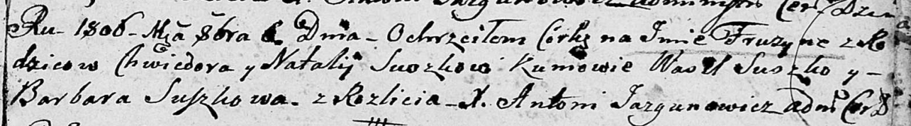

**Сушко Фрузына Хведорова (Suszkowna Fruzyna)**

6 октября 1806 г -- крещение (НИАБ 136-13-894, лист 61, №44/1806-р
(ориг)).

**НИАБ 136-13-894:** Лист 61. **Метрическая запись №44/1806-р (ориг).**

{width="6.496527777777778in"
height="0.9051826334208224in"}

Дедиловичская Покровская церковь. 6 октября 1806 года. Метрическая
запись о крещении.

Suszkowna Fruzyna -- дочь родителей с деревни Разлитье.

Suszko Chwiedor -- отец.

Suszkowa Natalija -- мать.

Suszko Wasil -- кум.

Suszkowa Barbara -- кума.

Jazgunowicz Antoni -- ксёндз.
