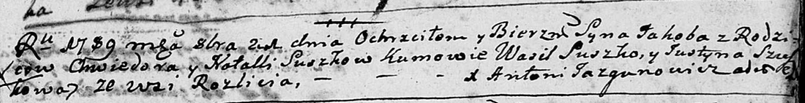
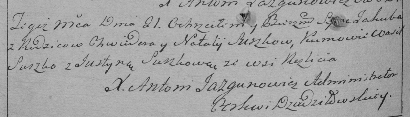

**Сушко Якоб Хведоров (Suszko Jakob)**

21 октября 1789 г -- крещение (НИАБ 136-13-894, лист 8, №55/1789-р
(ориг)), (РГИА 823-2-18, лист 238об, №26/1789-р (коп)).

**НИАБ 136-13-894:** Лист 8. **Метрическая запись №55/1789-р (ориг).**

Дедиловичская Покровская церковь. 21 октября 1789 года. Метрическая
запись о крещении.

Suszko Jakob -- сын родителей с деревни Разлитье.

Suszko Chwiedor -- отец.

Suszkowa Natalla -- мать.

Suszko Wasil - кум.

Szuszkowa Justyna - кума.

Jazgunowicz Antoni -- ксёндз.

**РГИА 823-2-18:** Лист 238об. **Метрическая запись №26/1789-р (коп).**

Дедиловичская Покровская церковь. 21 октября 1789 года. Метрическая
запись о крещении.

Suszko Jakub -- сын родителей с деревни Разлитье.

Suszko Chwiedor -- отец.

Suszko Natalja -- мать.

Suszko Wasil -- кум.

Suszkowa Justyna - кума.

Jazgunowicz Antoni -- ксёндз.
