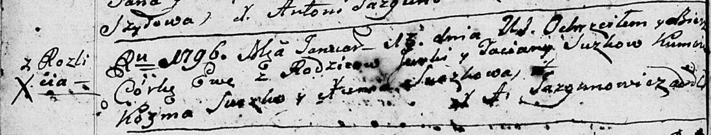

**Сушко Ева Юркова (Suszkowna Ewa)**

19 января 1796 г -- крещение (НИАБ 136-13-894, лист 27об, №7/1796-р
(ориг)).

**НИАБ 136-13-894:** Лист 21. **Метрическая запись №84/1793-р (ориг).**

{width="6.496527777777778in"
height="1.026544181977253in"}

Дедиловичская Покровская церковь. 21 декабря 1793 года. Метрическая
запись о крещении.

Suszkowna Mełania -- дочь селян с деревни Разлитье.

Suszko Jurka -- отец.

Suszkowa Taсiana-- мать.

Suszko Andrzey - кум.

Suszkowa Xienia - кума.

Jazgunowicz Antoni -- ксёндз.

**НИАБ 136-13-894:** Лист 27об. **Метрическая запись №7/1796-р (ориг).**

{width="6.496527777777778in"
height="1.2384241032370953in"}

Дедиловичская Покровская церковь. 19 января 1796 года. Метрическая
запись о крещении.

Suszkowa Ewa -- дочь родителей с деревни Разлитье.

Suszko Jurka -- отец.

Suszkowa Taciana -- мать.

Szuszko Kozma - кум.

Suszkowa Xienia - кума.

Jazgunowicz Antoni -- ксёндз.
