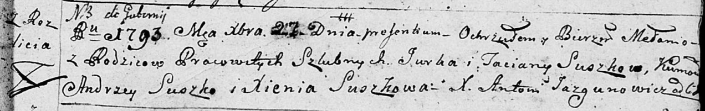
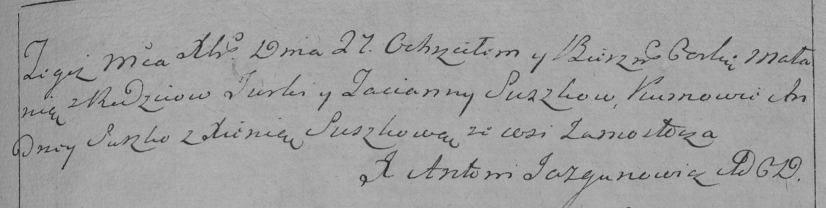
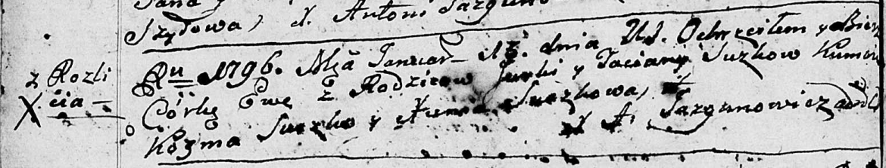
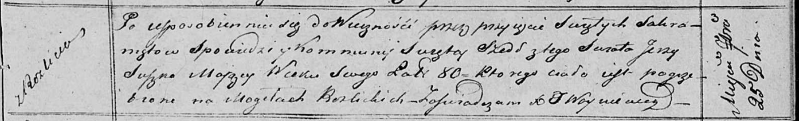

**Сушко Юрка (Suszko Jurka, Jerzy)**

27 декабря 1793 г -- крещение дочери Мелании (НИАБ 136-13-894, лист 21,
№84/1793-р (ориг)), (РГИА 823-2-18, лист 249, №50/1793-р (коп)).

19 января 1796 г -- крещение дочери Евы (НИАБ 136-13-894, лист 27об,
№7/1796-р (ориг)).

25 сентября 1820 г -- отпевание, умер в возрасте 80 лет (родился около
1740 г) (НИАБ 136-13-919, лист 34, №19/1820-у (ориг)).

**НИАБ 136-13-894:** Лист 21. **Метрическая запись №84/1793-р (ориг).**

Дедиловичская Покровская церковь. 27 декабря 1793 года. Метрическая
запись о крещении.

Suszkowna Mełania -- дочь селян с деревни Разлитье.

Suszko Jurka -- отец.

Suszkowa Taсiana-- мать.

Suszko Andrzey - кум.

Suszkowa Xienia - кума.

Jazgunowicz Antoni -- ксёндз.

**РГИА 823-2-18:** Лист 249. **Метрическая запись №50/1793-р (коп).**

Дедиловичская Покровская церковь. 27 декабря 1793 года. Метрическая
запись о крещении.

Suszkowna Małania -- дочь родителей с деревни \[Разлитье\].

Suszko Jurka -- отец.

Suszkowa Tacianna -- мать.

Suszko Andrzey -- кум.

Suszkowa Xienia -- кума.

Jazgunowicz Antoni -- ксёндз.

**НИАБ 136-13-894:** Лист 27об. **Метрическая запись №7/1796-р (ориг).**

Дедиловичская Покровская церковь. 19 января 1796 года. Метрическая
запись о крещении.

Suszkowa Ewa -- дочь родителей с деревни Разлитье.

Suszko Jurka -- отец.

Suszkowa Taciana -- мать.

Szuszko Kozma - кум.

Suszkowa Xienia - кума.

Jazgunowicz Antoni -- ксёндз.

**НИАБ 136-13-919:** Лист 34. **Метрическая запись №19/1820-у (ориг).**

Осовская униатская церковь. 25 сентября 1820 года. Метрическая запись об
отпевании.

Suszko Jerzy -- умерший, 80 лет, с деревни Разлитье, похоронен на
кладбище деревни Разлитье.

Woyniewicz Tomasz -- ксёндз.
