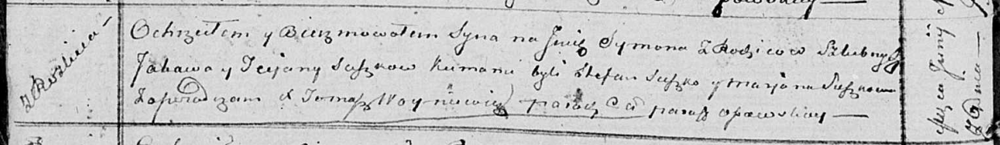

**Сушко Татьяна (Suszkowa Tecjana)**

7 июня 1814 г -- крещение сына Сымона (НИАБ 136-13-894, лист 89об,
№35/1814-р (ориг)).

**НИАБ 136-13-894:** Лист 89об. **Метрическая запись №35/1814-р
(ориг).**

{width="6.496527777777778in"
height="0.9474245406824147in"}

Осовская Покровская церковь. 7 июня 1814 года. Метрическая запись о
крещении.

Suszko Symon -- дочь родителей с деревни Разлитье.

Suszko Jakow -- отец.

Suszkowa Teciana -- мать.

Suszko Stefan -- кум.

Suszkowa Marjana -- кума.

Woyniewicz Tomasz -- ксёндз.
