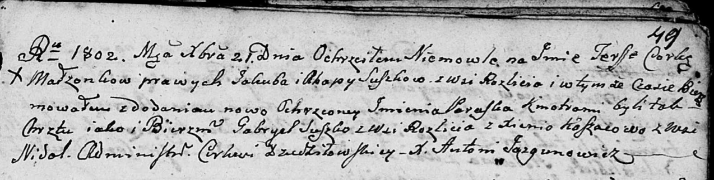
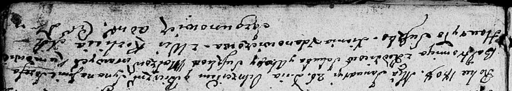

**Сушко Агапа (Suszkowa Ahapa, Ahafija)**

21 декабря 1802 г -- крещение дочери Тересы Параски (НИАБ 136-13-894,
лист 49, №46/1802-р (ориг)).

5 декабря 1803 г -- возможно, крестная мать Барбары Цецылии, дочери
Лапецов Якуба и Марьяны с деревни Дедиловичи (НИАБ 136-13-894, лист
52об, №48/1803-р (ориг)).

26 января 1806 г -- крещение сына Иосифа Балтромея (НИАБ 136-13-894,
лист 64, №5/1808-р (ориг)).

7 января 1812 г -- крещение дочери Марцеллы (НИАБ 136-13-894, лист 83,
№3/1812-р (ориг)).

**НИАБ 136-13-894:** Лист 49. **Метрическая запись №46/1802-р (ориг).**

Дедиловичская Покровская церковь. 21 декабря 1802 года. Метрическая
запись о крещении.

Suszkowna Teressa Paraska -- дочь родителей с деревни Разлитье.

Suszko Jakub -- отец.

Suszkowa Ahapa -- мать.

Suszko Gabryel -- кум, с деревни Разлитье.

Koszacowa Xienia -- кума, с деревни Недаль.

Jazgunowicz Antoni -- ксёндз.

**НИАБ 136-13-894:** Лист 52об. **Метрическая запись №48/1803-р
(ориг).**

Дедиловичская Покровская церковь. 5 декабря 1803 года. Метрическая
запись о крещении.

Łapciowna Barbara Cecylia -- дочь родителей с деревни Дедиловичи.

Łapać Jakub -- отец.

Łapciowa Marjana -- мать.

Suszko Leon -- кум, с деревни Разлитье.

Suszkowa Ahafija -- кума, с деревни Разлитье.

Jazgunowicz Antoni -- ксёндз.

**НИАБ 136-13-894:** Лист 64. **Метрическая запись №5/1808-р (ориг).**

Дедиловичская Покровская церковь. 26 января 1808 года. Метрическая
запись о крещении.

Suszko Jozef Baltromiey -- сын родителей с деревни Разлитье.

Suszko Jakub -- отец.

Suszkowa Ahapa -- мать.

Suszko Hauryło -- кум.

Żdanowiczowa Xienia -- кума.

Jazgunowicz Antoni -- ксёндз.

**НИАБ 136-13-894:** Лист 83. **Метрическая запись №3/1812-р (ориг).**

Осовская Покровская церковь. 7 января 1812 года. Метрическая запись о
крещении.

Suszkowna Marcella -- дочь родителей с деревни Разлитье.

Suszko Jakub -- отец.

Suszkowa Ahafija -- мать.

Suszko Haurylo -- кум.

Żyłkowa Xienia -- кума.

Woyniewicz Tomasz -- ксёндз.
