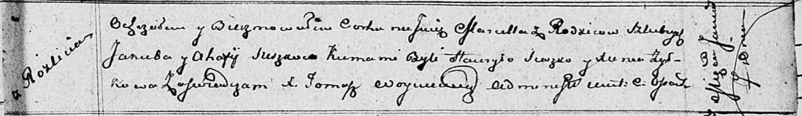

**Сушко Марцелла Якубова (Suszkowna Marcella)**

7 января 1812 г -- крещение (НИАБ 136-13-894, лист 83, №3/1812-р
(ориг)).

**НИАБ 136-13-894:** Лист 83. **Метрическая запись №3/1812-р (ориг).**

Осовская Покровская церковь. 7 января 1812 года. Метрическая запись о
крещении.

Suszkowna Marcella -- дочь родителей с деревни Разлитье.

Suszko Jakub -- отец.

Suszkowa Ahafija -- мать.

Suszko Haurylo -- кум.

Żyłkowa Xienia -- кума.

Woyniewicz Tomasz -- ксёндз.
