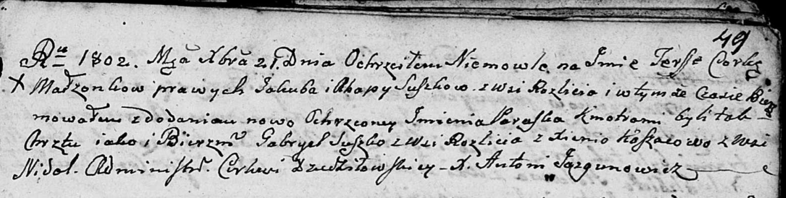

**Сушко Тереса Якубова (Suszkowna Teressa Paraska)**

21 декабря 1802 г -- крещение (НИАБ 136-13-894, лист 49, №46/1802-р
(ориг)).

**НИАБ 136-13-894:** Лист 49. **Метрическая запись №46/1802-р (ориг).**

Дедиловичская Покровская церковь. 21 декабря 1802 года. Метрическая
запись о крещении.

Suszkowna Teressa Paraska -- дочь родителей с деревни Разлитье.

Suszko Jakub -- отец.

Suszkowa Ahapa -- мать.

Suszko Gabryel -- кум, с деревни Разлитье.

Koszacowa Xienia -- кума, с деревни Недаль.

Jazgunowicz Antoni -- ксёндз.
