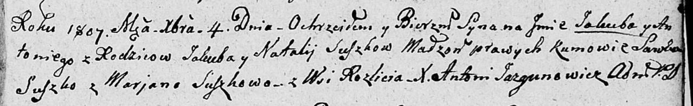

**Сушко Наталья (Suszkowa Natalija)**

4 декабря 1807 г -- крещение сына Якуба Антония (НИАБ 136-13-894, лист
64, №48/1807-р (ориг)).

**НИАБ 136-13-894:** Лист 64. **Метрическая запись №48/1807-р (ориг).**

Дедиловичская Покровская церковь. 4 декабря 1807 года. Метрическая
запись о крещении.

Suszko Jakub Antoni -- сын родителей с деревни Разлитье.

Suszko Jakub -- отец.

Suszkowa Natalija -- мать.

Suszko Sawka -- кум.

Suszkowa Marjana -- кума.

Jazgunowicz Antoni -- ксёндз.
