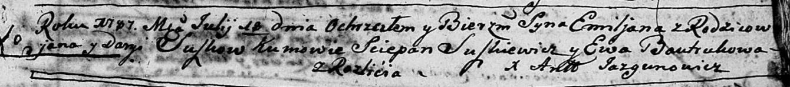
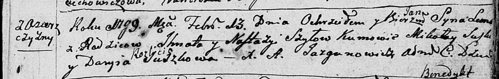

**Сушко Дарыя (Suszko Daryja)**

18 июля 1787 г -- крещение сына Емельяна (НИАБ 136-13-894, лист 2,
№31/1787-р (ориг)).

3 февраля 1799 г -- возможно, крестная мать Леона, сына Шил Игната и
Настасьи с деревни Озерщизна (НИАБ 136-13-894, лист 9об, №25/1790-р
(ориг)).

**НИАБ 136-13-894:** Лист 2. **Метрическая запись №31/1787-р (ориг).**

Дедиловичская Покровская церковь. 18 июля 1787 года. Метрическая запись
о крещении.

Suszko Emiljan -- сын родителей с деревни Разлитье.

Suszko Jan -- отец.

Suszkowa Daryja -- мать.

Suszkiewicz Sciepan -- кум.

Bautrukowa Ewa - кума.

Jazgunowicz Antoniusz -- ксёндз.

**НИАБ 136-13-894:** Лист 38. **Метрическая запись №8/1799-р (ориг).**

Дедиловичская Покровская церковь. 13 февраля 1799 года. Метрическая
запись о крещении.

Szyło Leon Jan -- сын родителей с деревни Озерщизна.

Szyło Jhnat -- отец.

Szyłowa Nastazyja -- мать.

Suszko Mikołay -- кум.

Suszkowa Daryia -- кума с деревни Разлитье.

Jazgunowicz Antoni -- ксёндз.
