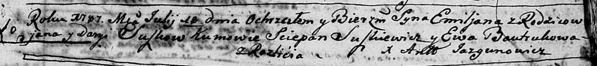

**Сушко Емельян Янов (Suszko Emiljan)**

18 июля 1787 г -- крещение (НИАБ 136-13-894, лист 2, №31/1787-р (ориг)).

**НИАБ 136-13-894:** Лист 2. **Метрическая запись №31/1787-р (ориг).**

Дедиловичская Покровская церковь. 18 июля 1787 года. Метрическая запись
о крещении.

Suszko Emiljan -- сын родителей с деревни Разлитье.

Suszko Jan -- отец.

Suszkowa Daryja -- мать.

Suszkiewicz Sciepan -- кум.

Bautrukowa Ewa - кума.

Jazgunowicz Antoniusz -- ксёндз.
