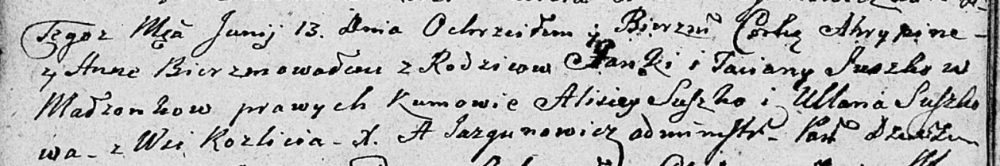

**Сушко Агрыпина Янова (Suszkowna Ahrypina Anna)**

13 июня 1809 г -- крещение (НИАБ 136-13-894, лист 74об, №29/1809-р
(ориг)).

**НИАБ 136-13-894:** Лист 74об. **Метрическая запись №29/1809-р
(ориг).**

Дедиловичская Покровская церковь. 13 июня 1809 года. Метрическая запись
о крещении.

Suszkowna Ahrypina Anna -- дочь родителей с деревни Разлитье.

Suszko Janka -- отец.

Suszkowa Taciana -- мать.

Suszko Alisiey -- кум.

Suszkowa Ullana -- кума.

Jazgunowicz Antoni -- ксёндз.
