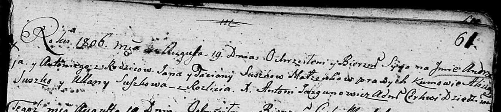

**Сушко Андрей Янов (Suszko Andrzey Antonij)**

19 августа 1806 г -- крещение (НИАБ 136-13-894, лист 61, №37/1806-р
(ориг)).

**НИАБ 136-13-894:** Лист 61. **Метрическая запись №37/1806-р (ориг).**

{width="6.496527777777778in"
height="1.4590201224846895in"}

Дедиловичская Покровская церковь. 19 августа 1806 года. Метрическая
запись о крещении.

Suszko Andrzey Antonij -- сын родителей с деревни Разлитье.

Suszko Jan -- отец.

Suszkowa Taciana -- мать.

Suszko Alisiey -- кум.

Suszkowa Ullana -- кума.

Jazgunowicz Antoni -- ксёндз.
